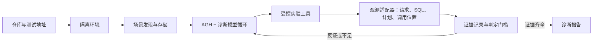

# 后端项目性能诊断 Agent：整体设计

日期：2026-09-30  
状态：已根据场景真实性、数据真实性、未知问题、工程质量风险和用户提供的赛事规则更新修订，待用户复核；尚未进入实现。

## 1. 决策摘要

输入一个后端项目的本地/测试地址与代码仓库，系统自行创建可重置的隔离环境，结合代码检查和运行实验，主动发现性能问题。首版只承诺三类：**慢查询/有代价的全表扫描、N+1 查询、深分页**。每条已验证结论必须指向具体 SQL、触发代码位置、可追溯证据和可执行的修改建议。系统不自动修复代码。

核心方法是“核对场景与数据的适用性 → 提出竞争假设 → 选择能区分假设的实验 → 用证据更新判断”。诊断模型负责假设与实验决策，Agnes Harness（AGH）承担工具执行闭环与记录；测量、证据完整性检查和环境重置由确定性程序负责。模型可按新版赛规选择，不将诊断流程绑定 Agnes 模型。九份 `project-doctor/docs/diagnosis/performance-agent-deepdive-*.md` 是候选诊断知识材料，其中三份对应首版范围；其指标只能触发怀疑，不能单独充当根因判据。

**差异化定位**：已有工具能采集性能 trace，现有调试 Agent 也能结合遥测与代码分析问题；本项目重点解决“测试场景是否代表实际使用、数据是否使问题成立、哪个实验能排除错误解释、结论能否逐项复核”。因此亮点应体现在主动构造与校验场景、受控反事实实验、完整证据链、证据不足时克制下结论、场景资产复用，而非工具数量或多 Agent 分工。[Chrome DevTools MCP](https://developer.chrome.com/blog/chrome-devtools-mcp)、[Sentry Seer](https://docs.sentry.io/product/ai-in-sentry/seer)。

## 2. 用户契约与能力边界

| 项目 | 约定 |
| --- | --- |
| 必需输入 | 项目代码仓库；本地或测试环境中的项目地址。地址用于识别待测服务；实际探测指向平台创建的隔离副本。 |
| 可选输入 | 测试账号、样例数据、关键业务操作、接口文档、性能目标、代表性流量样本。缺少时自动探索，但在报告中注明未覆盖范围。 |
| 项目启动 | 平台优先复用仓库已有的容器、启动、迁移与数据初始化配置；必要时生成隔离运行配方。缺少密钥、依赖服务或启动参数时请求补充；仍无法运行则报告阻断原因。 |
| 测试权限 | 隔离副本内可调用读写接口、生成测试数据、临时开启 trace/SQL 记录、执行查询计划分析、临时调整数据库结构进行反事实实验。实验结束后恢复同一初始状态。 |
| 输出 | 已验证问题清单、按测试负载影响排序、每项诊断卡、待验证线索、测试覆盖范围和执行记录。 |
| 不承诺 | 穷尽所有接口与输入组合；仅凭 HTTP 指标定位内部根因；对所有语言、ORM、数据库提供相同诊断深度；未经复测宣称优化收益。 |

没有用户性能目标时，系统可以证明某种退化机制及其测试条件，不能自行宣称“未达到业务性能要求”。没有代表性流量与数据时，系统只能报告“在本次实验条件下成立”，不能推断真实环境出现频率、损失规模或业务优先级。“所有已验证问题”限定为本轮预算内已探索的路径，报告须列出覆盖范围。

## 3. 系统边界与模块

| 模块 | 责任与边界 |
| --- | --- |
| 隔离环境 | 检查构建条件，启动服务和数据库，记录环境指纹，保存/恢复数据快照，限制执行时间与请求量。目标仓库不承载平台自身状态。 |
| 场景发现与存储 | 从路由、OpenAPI、现有测试、数据访问代码和运行反馈生成候选操作；组合可执行请求流程；保存场景定义、数据准备、断言与负载参数，避免再次生成相同场景。 |
| 观测适配器 | 将各语言/ORM/数据库的请求 trace、SQL 调用、执行计划、调用栈和代码位置映射为统一证据格式。无法准确定位调用位置时，只输出线索。 |
| AGH + 诊断模型 | 在约束内生成至多三个竞争假设，写出各自可检验的预测，选择下一项实验，依据反证调整。工具副作用、预算、授权与持久记录由 AGH 和平台工具约束，不由模型文字决定。 |
| 证据与报告 | 检查实验条件是否可比、原始证据是否存在、SQL 与代码是否关联；对已验证问题排序，显示证据、建议与限制。程序检查证据合同，根因解释仍须接受反证。 |

通用的是工作流与证据格式；SQL 调用位置、执行计划和数据准备需要适配目标技术栈。首个参考项目确定后实现相应适配器。若以后宣称已验证跨技术栈接入，应先让第二种技术栈的项目走完整条链路。不能把“可导入任意仓库”写成“任意仓库都能深度诊断”。

### 工程边界与代码质量

- 核心模型使用有版本的结构化合同：`Scenario`（用户操作与来源）、`DatasetProfile`（数据规模与分布）、`ExperimentSpec`（唯一变量与预算）、`Observation`（原始测量）、`Hypothesis`（预测与反证）、`Finding`（结论与证据引用）。字段含义和单位在一个位置定义；报告不直接读取各工具的私有输出。
- 环境、场景、观测、诊断、报告各模块只承担表中职责。工具适配器把原生格式转换成统一证据；核心流程不出现针对某 ORM 或数据库的散落条件分支。先实现首个项目所需适配器，再按真实差异抽象第二个，避免预建庞大插件框架。
- AGH 接入保持薄层：模型只能调用已声明的业务工具；实验执行、资源限制、快照恢复、证据校验是可单独理解的普通程序。纯数据转换与排序逻辑不依赖 AGH 会话对象。
- 场景与证据格式带版本；保存原始记录及转换后结果，适配器升级后仍可解释旧报告。错误使用明确类型（启动阻断、场景无效、证据不足、工具故障、环境污染），避免以一个通用异常吞掉原因。

## 4. 发现、实验与复用流程

1. **预检**：识别构建文件、服务入口、数据库、迁移/种子数据；创建隔离副本。若启动失败，保存可复现的错误和缺失信息。
2. **广度巡检**：从代码与运行服务枚举可访问操作。先执行有上限的轻量请求，记录接口、状态、响应与 SQL 活动；写入操作只在隔离副本执行，轮次间可重置。一次请求只有在完成预期业务动作、响应与已有断言一致时才是有效场景；随机参数造成的错误响应不算性能问题。
3. **候选收敛**：结合代码与运行观测筛选候选链路，记录未覆盖操作；具体诊断方法见第 5 节引用的专题文件。遇到三类范围之外的慢链路，保留为未分类异常。
4. **受控实验**：Agent 为候选问题列出竞争假设及预测，选择能区分假设的实验。每轮固定环境与基线条件，保留测量结果及波动；实验结束后恢复隔离环境。各问题的实验设计见第 5 节引用的专题文件。
5. **结论更新**：程序核对实验可比性与证据齐全性。假设被否定时继续测试或撤销；无法区分时明确“证据不足”。
6. **收尾**：按预算结束，保存任务状态与部分结果，恢复隔离环境，生成报告。下次可继续未覆盖路径。

场景与测量结果分开保存：场景的请求步骤、准备动作和断言可跨运行复用；同一任务内完全相同且状态未变化的实验可以去重。新任务要判断当前性能时，即使代码提交相同也重新测量；历史数值只用于比较。场景去重键至少包含操作路径、状态准备、参数类别、数据规模和负载，测量结果另绑定代码提交、环境配置、数据快照及观测配置；不能只按 URL 去重。保存凭据引用，不在场景中保存明文密钥。

### 场景与测试数据的真实性

- 每个场景保存“用户要完成什么、请求序列、参数来源、期望结果、数据规模、并发/到达方式、缓存状态”。来源标为：用户提供的真实操作或流量样本、仓库文档/测试推导、Agent 自行推断。用户可以纠正推断场景；纠正后另存版本，不覆盖原始实验条件。
- 平台在诊断前生成一张**适用性对照**：隔离环境与目标使用场景在代码/数据库版本、数据量、关联基数、热点值与长尾值、筛选选择性、并发、缓存和外部依赖上的一致处与未知处。差异影响执行计划或负载形状时，只能给出条件性结论。隔离环境的外部依赖应使用可控测试替身或明确记录真实依赖，避免误把外部服务延迟归于本项目。
- 数据来源优先级：经授权且脱敏的样本或数据分布统计 → 项目已有种子数据和业务规则 → 按 schema、约束与关系生成的数据。生成数据应保留主外键关系、数量级、取值倾斜与相关性；不能用均匀随机数据替代真实热点。只有 schema 而无分布信息时标为“合成数据”，不声称代表现实。数据导入后按数据库能力更新统计信息，再进行基线测量。
- 对 N+1、深分页和扫描问题，数据规模本身就是实验变量。报告同时给出触发所需规模与目标环境已知规模；若问题只在远超已知真实规模的数据量下出现，可以保留“该条件下机制已验证”，但把现实影响标为未验证，不排到现实高优先级。

## 5. 首版诊断专题文件

具体判定方法、证据门槛和诊断流程见以下文件，本设计稿只规定系统级流程与输出契约：

- 慢查询 / 全表扫描：见 [`performance-agent-deepdive-01-slow-query.md`](../../../project-doctor/docs/diagnosis/performance-agent-deepdive-01-slow-query.md)。
- N+1 查询：见 [`performance-agent-deepdive-02-n-plus-one.md`](../../../project-doctor/docs/diagnosis/performance-agent-deepdive-02-n-plus-one.md)。
- 深分页：见 [`performance-agent-deepdive-04-deep-pagination.md`](../../../project-doctor/docs/diagnosis/performance-agent-deepdive-04-deep-pagination.md)。

## 6. 影响排序与报告

问题按**本次测试负载下、证据支持的影响**排序，而不是声称线上业务优先级。优先采用可逆干预前后的请求延迟差；无法做干预时，展示受影响请求数、SQL 累计耗时、延迟分布和不确定性，明确该排序只是估计。场景或数据代表性较弱的结论保留在清单中，但与现实影响可靠的结论分开展示。同一 SQL 的两个机制共享耗时，不能各自重复计入全部收益。若用户提供代表性流量样本，可据其权重另给排序，并标注来源。

报告首页：项目与环境版本、场景/数据适用性摘要、预算和覆盖范围、已验证问题排序、未验证线索、未分类异常、未测试路径及阻断原因。每张诊断卡必须有：

1. 受影响接口/操作，触发条件；
2. 具体 SQL 或可核对的规范化 SQL，仓库提交、文件与行号；
3. 原始证据索引、实验变量与结果、被排除的竞争解释；
4. 影响数据、场景/数据来源、与目标使用方式的已知差异及适用范围；
5. 具体修改建议、适用条件与代价。

建议未经实施复测时标为“预计作用机制”，不能写成“已提升 X%”。正式结论以结构化证据引用支撑；模型生成的文字不能替代工具记录。

未分类异常单独列出症状、涉及链路、已采集证据、排除过的解释和下一项需要的观测能力。Agent 可以继续提出开放假设，但首版不把三类以外的问题包装成已完成的深度诊断；尤其不能为了填满报告把未知问题硬归为慢查询、N+1 或深分页。

## 7. 失败与继续执行

| 情况 | 行为 |
| --- | --- |
| 仓库或依赖无法启动 | 标为环境阻断，保存失败日志和缺失项；不生成性能结论。 |
| 某项观测缺失、SQL 无法定位代码 | 尝试允许的替代采集；仍不满足证据门槛则保留为待验证线索，继续其他路径。 |
| 测量波动大、实验条件不可比 | 重置环境并重复；仍不稳定则报告不确定性，不强行排序为已验证。 |
| 假设被反证 | 更新假设记录，选择新实验；保留失败实验的原始记录。 |
| 工具中断或预算耗尽 | 保存已生成场景和进度，输出部分报告，下次从未完成处继续；不重用已失效的性能数据。 |
| 数据或结构恢复失败 | 隔离该环境并停止依赖它的实验；后续结果不得混入原基线。 |
| 测试操作与实际业务不符、数据分布失真 | 暂停该场景的根因结论，保留已采集证据并记录差异；改造场景/数据后重新建立基线。 |
| 观测到首版三类以外的异常 | 记录未分类异常与已有证据，允许补充探索；证据不足或缺少适配能力时明确停止边界。 |

这些失败属于不同状态，不统一称为“重试”。只有原条件仍成立、工具调用可安全重复时才原参数重试；证据冲突要重规划，环境污染要终止并重建。

## 8. AGH 与赛事实现约束

AGH 必须承担诊断主循环中的模型与工具调用、状态和执行记录。诊断模型可从新版赛事规则允许的模型中选择；模型提供方、名称和版本作为运行配置记录，业务流程不依赖某个模型专有接口。业务能力通过 AGH 插件或 MCP 暴露为受控工具，例如项目预检、场景执行、SQL 采集、计划分析、调用位置定位、快照恢复、证据比较。工具分别声明只读/有副作用、超时、预算和是否可安全重放。AGH 本地文档已有后端工具注册示例与会话导出路径，分别见 [`backend.zh-CN.md`](../../../agh-test/docs/develop/backend.zh-CN.md) 和 [`sessions.zh-CN.md`](../../../agh-test/docs/guide/sessions.zh-CN.md)。

当前工作区的 [`AGH-测试记录.md`](../../../AGH-测试记录.md)只确认本地构建、服务启动和示例组件测试；**选定的诊断模型通过 AGH 实际调用业务工具，以及导出真实诊断链记录，尚未验证**。这属于实现前的首个集成检查。比赛要求正常、边界、失败情形和可核查的 AGH 执行记录；本稿只规定产品诊断流程，离线验收集、评估集与其指标设计不在本次讨论范围内。

**规则核对状态**：2026-09-30 用户提供的新版规则信息是“允许使用其他模型，但必须使用 AGH”，本设计据此取消 Agnes 单模型限制。公开[赛事页面](https://agnes-ai.cn/hackathon)目前仍显示旧的 Agnes 模型限制；提交前应以主办方新版公告或报名页面为准，并保存规则依据。模型选择不改变 AGH 必须参与核心诊断链路的要求。

## 9. 演示项目交接条件与非目标

负责演示项目的成员需交付：可获取的仓库与固定提交、可复现启动/重置步骤、数据库与迁移信息、可用测试入口和必要的测试凭据引用。若有既有容器配置和真实业务操作说明，优先复用。首个数据库及 ORM 适配器随该项目确定；在第二种技术栈通过同一工作流前，不宣称跨栈兼容已验证。

首版不做自动代码修复、生产环境压测、所有九类问题的诊断、全语言静态解析器，也不把通用监控平台、负载测试器或 profiler 重新实现一遍。可复用能力优先来自目标项目已有设施和成熟工具；平台只实现实验编排、证据关联、诊断决策和报告。

