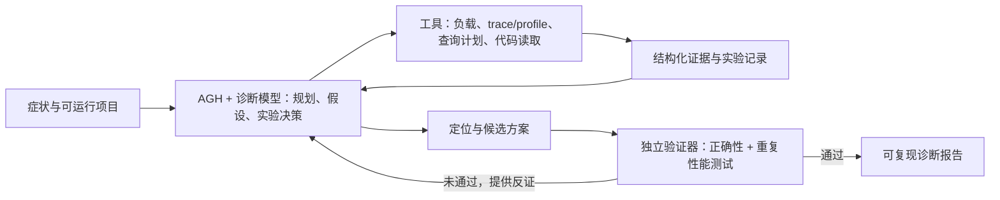

> 此文件是早期讨论草案，已由正式设计稿取代；正式设计稿目前仍在仓库外的资料目录中。原稿中的 Agnes 单模型限制已按 2026-09-30 用户提供的规则更新修订，其他早期方案不代表当前决策。

# 项目性能诊断 Agent：设计草案 v0.1

> 状态：讨论稿。主场景已确定为后端性能诊断。产品接口面向不同技术栈；首个演示项目和深度适配器仍待确定。

## 决策摘要

一句话目标：给定可运行后端项目与一个性能症状，Agent 通过受控实验定位瓶颈，输出可复现证据、优化建议，并由独立测试判断建议是否真的改善且没有破坏功能。

本项目的价值不在于“AI 会看火焰图”，而在于**把猜测变成可证伪的实验**。例如面对接口变慢，Agent 同时考虑数据库查询、应用计算、锁等待三种解释，选择能区分它们的测量，再决定下一步。

架构层不绑定语言或框架，但诊断深度取决于目标项目可提供的证据。首版选一个参考项目验证完整闭环，再用第二种技术栈或独立样例验证通用协议；不能把“可接入任意 HTTP 服务”表述成“能深度诊断任意项目”。

## 赛事约束与当前证据

- 用户提供的新版赛事规则允许使用其他模型，但必须使用 AGH 承担核心任务；需完成连续步骤、外部能力调用、结果验证，并提交正常、边界、失败三类样例及 AGH 执行记录。公开赛事页面仍显示旧限制，最终以主办方新版公告为准。
- 本科组权重：任务完成度与正确性 25%，AGH 与模型执行闭环 20%，问题价值 20%，创新性 15%，技术深度 10%，验证与异常 10%。
- 资料目录中的 `AGH-测试记录.md` 已证明本地构建、服务启动和示例工具组件测试可行；**选定模型经 AGH 真实调用工具尚未验证**。这是第一项阻断性实验。
- 现有产品已覆盖 trace 分析和部分自动修复，因此不能把“接入监控 + AI 给建议”当作创新点。参考：[Chrome DevTools MCP](https://developer.chrome.com/blog/chrome-devtools-mcp)、[Sentry Seer](https://docs.sentry.io/product/ai-in-sentry/seer)。

## 目标用户与输入输出

用户：需要定位后端性能问题的开发团队。系统接受任意能执行约定负载的 HTTP 项目；更深层的 SQL、连接池和运行时归因依赖遥测与适配器。

输入：项目启动/访问方式、目标接口、正确性断言、性能目标、测试数据、允许的观测接口与资源上限。可选输入为仓库路径、OTLP traces/metrics/logs、SQL 执行计划接口、profiler 与配置快照。没有可运行环境或缺少正确性断言时，系统应报告“证据不足”，而非编造根因。

输出：复现命令/脚本、实验环境指纹、基线指标、各假设和反证、定位到代码/查询的证据、候选修改、前后对照结果、回归测试结果、AGH 工具调用记录。每项结论标明“已验证 / 仍是推断 / 无法判断”。

### 诊断深度分级

| 级别 | 最低输入 | 能可靠交付 | 不能宣称 |
| --- | --- | --- | --- |
| L0 黑盒 | HTTP 接口与可重复负载 | 延迟/错误率/响应字节、并发和数据规模下的症状曲线 | SQL、连接池、线程等内部根因 |
| L1 遥测 | 按请求关联的 trace、SQL span、池指标等 | 将慢链路定位到数据库调用次数/时长、连接等待或响应传输等阶段 | 缺少细粒度证据时的具体代码根因 |
| L2 深度适配 | 查询计划、代码位置、运行时 profile、配置变更 | 验证具体机制并给出代码或配置级建议 | 对未接入的技术栈作同等深度承诺 |

通用契约先规范 `run_id / trace_id / 时间窗 / 环境指纹 / 工作负载 / 指标 / 证据来源`，再用适配器把各栈数据映射进去。OpenTelemetry 有数据库 span 语义，但连接池指标约定仍标为 Development，因此映射层应接受厂商原生指标，不能写死一组名称。[数据库 span](https://opentelemetry.io/docs/specs/semconv/db/database-spans/)、[连接池指标](https://opentelemetry.io/docs/specs/semconv/db/database-metrics/)。

## 首版问题范围

首版只诊断慢查询 / 全表扫描、N+1 查询、深分页。各问题的指标、判定方法和证据讨论分别见 [`performance-agent-deepdive-01-slow-query.md`](diagnosis/performance-agent-deepdive-01-slow-query.md)、[`performance-agent-deepdive-02-n-plus-one.md`](diagnosis/performance-agent-deepdive-02-n-plus-one.md)、[`performance-agent-deepdive-04-deep-pagination.md`](diagnosis/performance-agent-deepdive-04-deep-pagination.md)。

其余候选问题见 `docs/diagnosis/` 中的 `performance-agent-deepdive-03-connection-pool.md`、`performance-agent-deepdive-05-large-response.md` 至 `performance-agent-deepdive-09-config-regression.md`，不计入首版已支持范围。当前完整范围以正式设计稿为准。

## 核心执行闭环

1. **限定任务**：解析项目与目标链路；检查可启动性、测试数据和验收条件。
2. **建立基线**：固定数据、负载、缓存状态和机器环境；重复测量延迟分布、错误率与资源指标。测量波动过大则先调整实验，不急于归因。
3. **提出竞争假设**：由诊断模型结合代码、指标和 trace 给出最多 3 个候选瓶颈，写明每个假设的可观测预测。
4. **选择区分实验**：由诊断模型决定下一项工具调用，如改变数据规模、并发数、缓存状态，或采集 CPU profile、SQL 执行计划。实验必须能排除至少一个假设。
5. **定位与建议**：把实验结果指向具体函数、查询或调用链；给出预计收益和可能的正确性风险。首版允许只建议修改；自动改代码作为后续能力。
6. **独立验收**：预先固定的验证器重新运行正确性测试与基准负载。修复者不能改写验证器、测试数据或通过标准。未达到性能目标、错误率上升或结果不正确时判失败，并把反证送回 AGH 再诊断。

## 技术边界与复用

- AGH 负责会话、模型与工具执行记录、失败后的继续执行；通过其插件或 MCP 接入业务工具。仓库示例 `agh-test/docs/develop/backend.zh-CN.md` 已给出插件注册入口，但真实模型调用仍需实测。
- 测量工具复用成熟能力：API 负载可用 k6 的场景和阈值；浏览器交互可用 Playwright trace；跨服务数据可遵循 OpenTelemetry trace/metric/log 语义。具体组合随目标场景确定。参考：[k6 scenarios](https://grafana.com/docs/k6/latest/using-k6/scenarios/)、[k6 thresholds](https://grafana.com/docs/k6/latest/using-k6/thresholds/)、[Playwright Trace Viewer](https://playwright.dev/docs/trace-viewer)、[OpenTelemetry signals](https://opentelemetry.io/docs/concepts/signals/)。
- 自研部分仅包括：实验任务契约、假设与证据账本、实验选择约束、结果比较与验收编排。不要重新实现负载测试器、trace 收集器或 profiler。
- 本地 Windows 开发要核对 profiler 支持范围；Pyroscope 文档显示其 Java/Python SDK 当前不支持 Windows，因此不能默认选它作为本机方案。[平台支持表](https://grafana.com/docs/pyroscope/latest/configure-client/supported-platforms/)。

## 首版验收场景

| 类型 | 样例 | 预期结果 |
| --- | --- | --- |
| 正常 | 样例接口随数据量增加变慢，原因是重复数据库查询 | Agent 用负载与查询证据区分应用计算和数据库原因；报告能复现；修改后独立测量改善且结果正确 |
| 边界 | 小数据量正常、大数据量越过目标；或冷热缓存结论相反 | 报告适用范围，不以一次平均值宣称普遍优化 |
| 失败 | 压测工具中断、trace 缺失、测量波动过大，或候选修改使结果错误 | 保留失败记录；重试/改用可用证据/终止并报告证据不足；错误修改被验证器拒绝 |

性能验收需先固定：同一机器与依赖版本、相同数据集与负载、预热策略、重复次数、正确性测试、误差容忍度。候选指标包括 p95 延迟、吞吐、错误率、CPU/内存、诊断根因准确率、诊断耗时和工具成本。具体阈值应在首次基线后设定，不能倒推。

## MVP 路线与否决条件

1. 先用选定的获准模型验证“模型在 AGH 中真实调用自定义工具，并可导出记录”。失败则先解决集成，暂停业务功能。
2. 选一个可本地运行且有预置性能缺陷的样例项目，手工跑通基线、诊断证据和独立复测。
3. 把这条链路接入 AGH，再增加一个会误导直觉的对照案例，证明 Agent 会通过实验排除错误假设。
4. 录制 3～5 分钟操作演示，整理正常、边界、失败证据。

否决条件：真实 AGH 工具链无法打通；无法稳定重现问题；没有独立正确性标准；所有诊断只是固定规则即可完成。任一项未解决前，不扩展为通用平台。

## 待团队确认

1. 主战场：后端 API、前端交互、数据库查询，还是一个明确的全链路操作？
2. 目标技术栈和真实可用的样例项目是什么？是否允许为比赛构造可解释的缺陷样例？
3. 交付边界：只诊断和建议，还是必须自动修改代码？建议先把独立验证做扎实，再决定是否加入自动修复。

